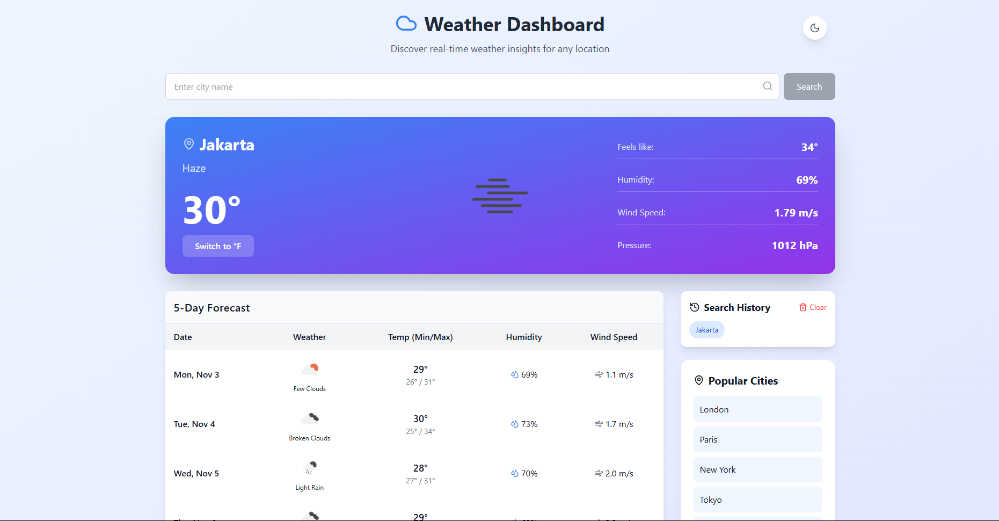
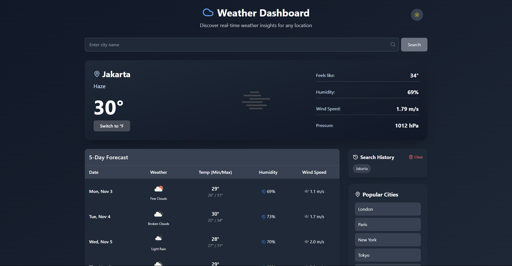
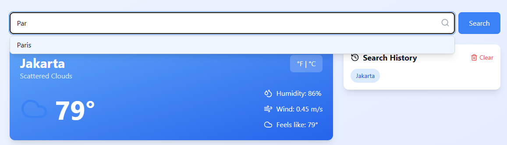
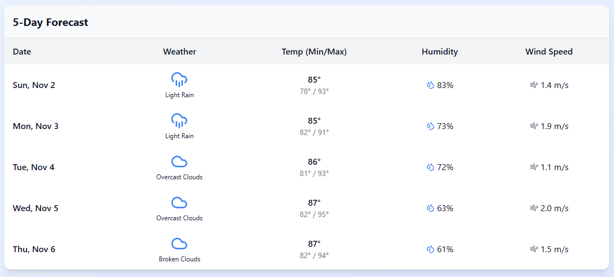

# Abel Weather Dashboard

## Nama, NIM, dan Kelas
Abel Fortino 
123140111 
Pengembangan Aplikasi Web RA

## Deskripsi
Aplikasi dashboard cuaca real-time yang dibangun menggunakan React dan Tailwind CSS. Aplikasi ini memungkinkan pengguna untuk mencari informasi cuaca saat ini, melihat prakiraan cuaca harian, serta mengelola riwayat pencarian kota. Fitur utama meliputi:
- ✅ Pencarian cuaca real-time berdasarkan nama kota
- ✅ Display cuaca saat ini dengan icon, temperature, humidity, wind speed
- ✅ Table forecast 5 hari ke depan
- ✅ Riwayat pencarian kota dengan opsi clear
- ✅ Mode gelap/terang yang dapat diubah
- ✅ Autocomplete pada input pencarian
- ✅ Toggle unit suhu (Celsius/Fahrenheit)
- ✅ History pencarian kota - simpan di localStorage

*Untuk Weather Dashboard ini hanya menyediakan beberapa Kota. Antara lain : London, Paris, New York, Tokyo, Sydney, Jakarta, Singapore, Bangkok, Dubai, Rome, Berlin, Madrid, Amsterdam, Seoul, dan Mumbai.*

## Cara Instalasi
1. Pastikan Anda memiliki Node.js dan npm terinstal di sistem Anda.
2. Clone repository ini:
   ```
   git clone https://github.com/AbelFortino/uts-pemweb-123140111/
   ```
3. Masuk ke direktori proyek:
   ```
   cd abel-weather-dashboard
   ```
4. Instal dependensi:
   ```
   npm install
   ```
5. Jalankan aplikasi dalam mode development:
   ```
   npm start
   ```
6. Buka browser dan akses http://localhost:3000

## Link Deployment
Aplikasi ini telah di-deploy di Vercel https://uts-pemweb-123140111.vercel.app

## Screenshot
### Tampilan Utama (Light Mode)


### Tampilan Utama (Dark Mode)


### Pencarian Kota


### Prakiraan Cuaca


## Teknologi yang Digunakan
- **React**: Library JavaScript untuk membangun user interface
- **Tailwind CSS**: Framework CSS untuk styling
- **OpenWeatherMap API**: Sumber data cuaca
- **Vercel**: Platform deployment

## Struktur Proyek
```
abel-weather-dashboard/
├── public/
│   ├── index.html
├── src/
│   ├── components/
│   │   ├── SearchForm.jsx
│   │   ├── CurrentWeather.jsx
│   │   ├── ForecastTable.jsx
│   │   ├── SearchHistory.jsx
│   │   └── WeatherIcon.jsx
│   ├── contexts/
│   │   └── ThemeContext.jsx
│   ├── utils/
│   │   └── api.js
│   ├── App.jsx
│   ├── App.css
│   └── index.js
├── screenshots/
├── package.json
├── tailwind.config.js
├── postcss.config.js
└── README.md
